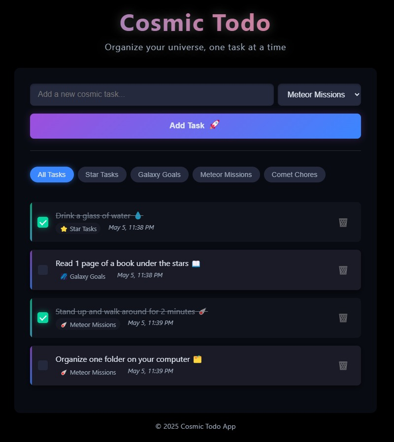

# 🚀 Cosmic Todo App

## Journey Through Task Management Space

# 🚀 Cosmic Todo App

## Journey Through Task Management Space

[](https://cosmic-to-do.vercel.app)

Welcome to the Cosmic Todo App, where task management transcends the ordinary and ventures into the celestial! This React-powered application brings a touch of the cosmos to your daily organization, making productivity an interstellar adventure.

## ✨ Stellar Features

- **Cosmic Categorization**: Organize your tasks into stellar categories including "Star Tasks" and other cosmic collections
- **Galaxy Filtering**: Navigate your task universe by filtering through different cosmic categories
- **Supernova UI**: Experience a visually captivating interface with space-themed elements
- **Celestial Tracking**: Mark tasks as complete and watch them fade into the cosmic background
- **Meteor-Quick Performance**: Built with React's latest hooks and optimization techniques for lightning-fast interactions

## 🛰️ Technologies in Our Orbit

- React 19.1.0
- Modern React Hooks (useState for state management)
- CSS3 for cosmic styling
- JavaScript ES6+
- Create React App as launch vehicle

## 🌠 Installation Launch Sequence

To deploy this application in your local environment, follow these cosmic commands:

```bash
# Clone this repository into your dimension
git clone https://github.com/AARUSHGAUR/cosmic-to-do.git

# Navigate to the project's core
cd cosmic-todo-app

# Install the necessary cosmic modules
npm install

# Initiate the launch sequence
npm start
```

## 🪐 Usage Guide for Space Travelers

1. **Adding New Tasks**: Enter your task in the input field and select a category from the dropdown
2. **Launch Tasks**: Click the 🚀 button to add your task to the cosmos
3. **Navigate Categories**: Use the filter buttons to explore tasks in different cosmic categories
4. **Complete Tasks**: Click on a task to mark it as completed
5. **Delete Tasks**: Remove tasks from your universe with the delete button

## 📸 Cosmic Snapshots

Here’s a glimpse of the Cosmic Todo App in action:



## 👩‍🚀 Join Our Space Program

Contributions are what make the open-source community such an amazing place to learn, inspire, and create. Any contributions you make to the Cosmic Todo App are **greatly appreciated**.

1. Fork the Project
2. Create your Feature Branch (`git checkout -b feature/AmazingFeature`)
3. Commit your Changes (`git commit -m 'Add some AmazingFeature'`)
4. Push to the Branch (`git push origin feature/AmazingFeature`)
5. Open a Pull Request

## 📜 Universal License

This project is licensed under the MIT License - see the LICENSE file for details.

---

*"Organizing tasks across the universe, one star at a time."*
